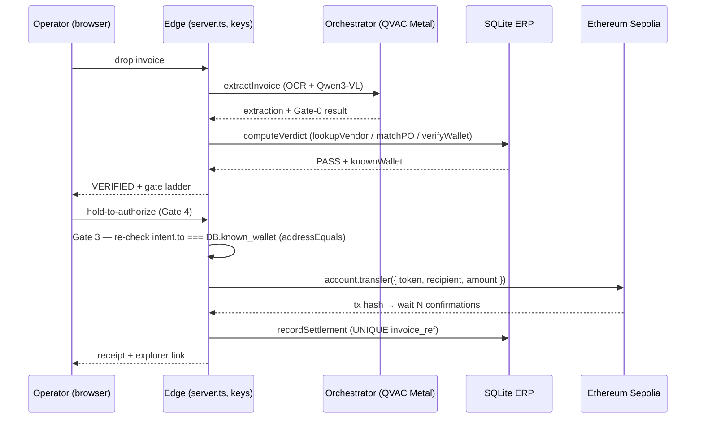

# Architecture

Custos splits accounts-payable across two machines joined by QVAC's P2P. The
Orchestrator reads and verifies; the Edge holds keys and signs. The full design is in
[Custos-PRD.md](./Custos-PRD.md); this file maps it to the code.

## Two-node mesh

```mermaid
flowchart LR
  subgraph Edge["Edge &middot; Intel i5 &middot; 16GB &middot; no local inference &middot; holds keys"]
    UI["Edge console (server.ts)<br/>WDK signer (wallet.ts, settle.ts)<br/>P2P consumer (consumer.ts)"]
  end
  subgraph Orch["Orchestrator &middot; M1 Pro &middot; 32GB &middot; QVAC Metal &middot; no keys"]
    QV["Qwen3-VL-2B + ocr-onnx (extract.ts)<br/>GTE-large RAG + tool-calling (erp.ts, tools.ts)"]
  end
  UI <-->|"QVAC P2P &middot; Holepunch, E2E-encrypted (provider.ts / consumer.ts)"| QV
  UI -->|"signed USD&#8366; transfer"| SEP[("Ethereum Sepolia<br/>test USD&#8366; 0xd077a4&hellip;e4fdb")]
```

QVAC's macOS-x64 build can't run these models reliably (its llama.cpp build suppresses stop
tokens → runaway generation), so the Intel node runs **no local inference at all** and
**delegates every AI task** to the Metal M1. The consumer uses `fallbackToLocal: false`: if the
Orchestrator is unreachable the Edge **hard-stops** ("orchestrator offline, cannot proceed")
and never settles on a degraded result (threat #82). The C1 demo
([evidence/c1-report.md](./evidence/c1-report.md)) proves the delegated round-trip and the
offline hard-stop. Keys exist only on the Edge
([packages/edge/src/wallet.ts](./packages/edge/src/wallet.ts)); the Orchestrator has no key API
surface.

## Pipeline

```mermaid
flowchart TD
  A["Invoice image"] --> OCR["ocr-onnx &middot; OCR_LATIN_RECOGNIZER_1 + OCR_CRAFT_DETECTOR"]
  OCR --> G0{"Gate 0<br/>normalizeForLLM (gate0.ts)"}
  G0 -->|"decoded imperative"| R0["REJECT &middot; logged"]
  G0 -->|"clean"| EX["Qwen3-VL-2B<br/>responseFormat: json_schema (extract.ts)"]
  EX --> Z["Zod validate + OCR/vision cross-check (#26)"]
  Z --> G2{"Gate 2<br/>ERP: vendor + PO + currency (verdict.ts)"}
  G2 -->|"no exact match"| R2["REJECT"]
  G2 -->|"match"| G3{"Gate 3<br/>wallet vs DB known_wallet"}
  G3 -->|"mismatch"| R3["REJECT"]
  G3 -->|"corroborates"| I["buildPaymentIntent &middot; to = DB known_wallet (intent.ts)"]
  I --> G4{"Gate 4<br/>human approval"}
  G4 -->|"no"| S["no send"]
  G4 -->|"approve"| G5{"Gate 5<br/>pin chain+token &middot; re-check intent.to &middot; exact transfer &middot; N conf (settle.ts)"}
  G5 --> TX["on-chain USD&#8366; + settlements row"]
```

Stages and their files:

| Stage | File | What |
|---|---|---|
| OCR | [extract.ts](./packages/orchestrator/src/extract.ts) | `ocr-onnx` → raw text (independent of the vision model) |
| Gate 0 | [security/gate0.ts](./security/gate0.ts) | NFKC + strip invisibles + decode battery; a decoded imperative → REJECT + log |
| Extraction | [extract.ts](./packages/orchestrator/src/extract.ts) | Qwen3-VL-2B with grammar-constrained JSON (`responseFormat: json_schema`), Zod-validated |
| ERP + verdict | [erp.ts](./packages/orchestrator/src/erp.ts), [verdict.ts](./packages/orchestrator/src/verdict.ts) | `better-sqlite3` + `sqlite-vec`; `lookupVendor` / `matchPurchaseOrder` / `verifyWallet` / `isDuplicateInvoice` → deterministic `computeVerdict` |
| Intent | [intent.ts](./packages/shared/src/intent.ts) | `PaymentIntent { to, amount, token, chainId, invoiceRef, memo }`; `to` = DB `known_wallet` |
| Settlement | [settle.ts](./packages/edge/src/settle.ts), [wallet.ts](./packages/edge/src/wallet.ts) | WDK `account.transfer({ token, recipient, amount })`, confirmations, `recordSettlement` |

## Settlement sequence

Proven on-chain: tx
[`0xa3ed0f33…f79cd30`](https://sepolia.etherscan.io/tx/0xa3ed0f33fcfa685287185284079884c0ea0c3a260149443bfd945f083f79cd30)
— 1 USD₮, block 11,103,356, 2 confirmations
([evidence/c4-report.md](./evidence/c4-report.md)).

## Inference & logging

Every QVAC call goes through audit wrappers
([packages/shared/src/audit.ts](./packages/shared/src/audit.ts)) that append a row to
[evidence/inference-log.jsonl](./evidence/inference-log.jsonl) (mirrored to `.csv`) with
token/TTFT/throughput taken from the SDK profiler (`metrics_source: "profiler-raw"`). The
raw profiler export is [evidence/profiler-summary.txt](./evidence/profiler-summary.txt).

## The browser is a thin client

[packages/edge/src/server.ts](./packages/edge/src/server.ts) (dependency-free `node:http`)
runs the pipeline server-side and streams gate status as NDJSON. The browser
([packages/edge/ui/](./packages/edge/ui/)) renders the gate ladder and the
hold-to-authorize control; it never sees the seed. With no `.env` the server runs the full
pipeline and both blocked-attack cases, stopping at Gate 4 (demo mode).

See [SECURITY.md](./SECURITY.md) for trust boundaries and the gate model.
