# Custos — Air-Gapped Agentic Settlement

> Reads vendor invoices **locally** via the QVAC SDK, verifies them against an internal
> ERP with on-device OCR + multimodal vision + tool-calling + RAG, and settles **real
> on-chain USD₮** through Tether's WDK — **zero cloud, zero data leakage.** Built for
> QVAC Hackathon I (Tether / DoraHacks).

**Team:** Tim (`@winsznx`) + Anu (`@svector`) · **Track:** General Purpose (≤32 GB) + Build in Public · **License:** Apache-2.0

All AI inference — LLM, multimodal, OCR, embeddings, RAG, tool-calling — runs through
**`@qvac/sdk`**, 100% on-device. The only remote calls are non-AI blockchain endpoints,
fully disclosed in [`remote_apis.json`](./remote_apis.json).

A real settlement proven on Ethereum Sepolia:
[`0xa3ed0f33…f79cd30`](https://sepolia.etherscan.io/tx/0xa3ed0f33fcfa685287185284079884c0ea0c3a260149443bfd945f083f79cd30).

---

## The thesis: safe by construction

A payment is **impossible** unless it clears **every gate**. No single component — least
of all the model — can move funds. Drop a poisoned invoice and watch it stop.

| Gate | What it does |
|---|---|
| **G0 — Input decode** | NFKC + strip zero-width/bidi/PUA/tag; decode Morse/base64/hex/ROT13/leet/homoglyph (nested). A decoded imperative → flag + log + REJECT. |
| **G1 — Role bounding** | the LLM extracts + proposes only; it has no settlement authority. |
| **G2 — Deterministic truth** | vendor / PO / wallet come from the **SQLite ERP**, never the document. Exact match, integer minor-units, currency exact. |
| **G3 — Recipient re-check** | `intent.to === DB.known_wallet` in plain code (EIP-55), re-checked on the key-holder before signing. |
| **G4 — Human approval** | an explicit, deliberate signature on the Edge node. |
| **G5 — On-chain safety** | pinned chainId + token, exact-amount transfer (no unbounded approve), N confirmations, MEV-protected RPC. |

Full security model: [`Custos-Threat-Model.md`](./Custos-Threat-Model.md) — 100 attack
vectors + the Gate-0 encoding battery (Grades A–J).

## Architecture (two-node P2P mesh)

| Node | Role | Machine | Inference |
|---|---|---|---|
| **Orchestrator** "Vault" | heavy multimodal LLM · OCR · RAG · tool-calling · builds PaymentIntent — **no keys** | M1 Pro · 32 GB · macOS 26.5.1 | QVAC **Metal** |
| **Edge** "AP Clerk" | UI · routing · **holds keys** · human approve + sign | Intel i5 · 16 GB · macOS 15.7.7 | QVAC **CPU** |

The Intel node *delegates* heavy inference to the Metal M1 over QVAC's E2E-encrypted P2P
(Holepunch) — a real hardware necessity (macOS-x64 is CPU-only), not staged.

```mermaid
flowchart LR
  subgraph Edge["Edge &middot; Intel &middot; QVAC CPU &middot; holds keys"]
    UI["Edge console + WDK signer"]
  end
  subgraph Orch["Orchestrator &middot; M1 Pro &middot; QVAC Metal &middot; no keys"]
    QV["Qwen3-VL-2B &middot; OCR &middot; GTE-large RAG &middot; tool-calling"]
  end
  UI <-->|"QVAC P2P (Holepunch, E2E)"| QV
  UI -->|"signed USD&#8366; transfer"| SEP[("Ethereum Sepolia")]
```



Full design + the pipeline/sequence diagrams: [ARCHITECTURE.md](./ARCHITECTURE.md).

---

## Quickstart

Requires **Node ≥ 22.17** and **npm ≥ 10.9** (macOS ≥ 14.0 for QVAC).

```bash
npm install
npm i @qvac/sdk @tetherto/wdk-wallet-evm   # native + model deps

# launch the Edge settlement console
npm run serve            # → http://localhost:4173
```

**No secrets needed to evaluate.** With no `.env`, the console runs the full pipeline and
both blocked-attack cases and stops cleanly at Gate 4 (demo mode). The first run downloads
the models from the QVAC registry. Drop an invoice (or pick a sample) and watch it pass the
gate ladder; a prompt-injection or amount-mismatch invoice is blocked at its gate.

**To settle for real:** set `CUSTOS_WALLET_SEED` in `.env` to a self-custodial wallet
funded with Sepolia ETH + test USD₮ (Pimlico/Candide faucet), restart, and **hold to
authorize** — a real transfer settles on Sepolia with a receipt + explorer link.

### Headless demos (one component at a time)

```bash
CUSTOS_NODE=orchestrator npm run smoke   # C0 · QVAC Metal smoke + metrics
npm run c1:demo                          # C1 · P2P delegation (offline-detect + degraded fallback)
npm run c2:demo                          # C2 · invoice image → validated JSON (OCR + Qwen3-VL)
npm run c3:demo                          # C3 · ERP verdict: PASS + REJECT cases + QVAC tool-calling
npm run csec:test                        # C-sec · Gate-0 battery, 17/17 green
CUSTOS_APPROVE=I-APPROVE npm run c4:demo  # C4 · REAL on-chain USD₮ settlement, behind every gate
```

---

## Build order

**C0** env + smoke + model probe → **C1** P2P bridge → **C2** multimodal extraction →
**C3** ERP + verification → **C-sec** Gate-0 battery → **C4** WDK settlement → **C5** Edge
UI → C6 evidence → C7 ship. Each phase has a report in [`evidence/`](./evidence/).

## Documentation

- [ARCHITECTURE.md](./ARCHITECTURE.md) — two-node mesh, pipeline + settlement diagrams.
- [SECURITY.md](./SECURITY.md) — the six gates, trust boundaries, "LLM proposes / code authorizes".
- [THREAT-MODEL.md](./THREAT-MODEL.md) — 100 vectors mapped to the gates (full catalogue: [Custos-Threat-Model.md](./Custos-Threat-Model.md)).
- [ADVERSARIAL-TESTING.md](./ADVERSARIAL-TESTING.md) — the Gate-0 encoding battery (17/17).
- [DEMO_SCRIPT.md](./DEMO_SCRIPT.md) · [SUBMISSION_CHECKLIST.md](./SUBMISSION_CHECKLIST.md).

## Evidence bundle

- [`evidence/inference-log.jsonl`](./evidence/inference-log.jsonl) + `.csv` — every QVAC
  call, logged from the profiler (node, delegated?, model, op, prompt/completion tokens,
  TTFT, tok/s, backend device). Never hand-written.
- [`remote_apis.json`](./remote_apis.json) — all remote calls (only non-AI: Sepolia RPC) +
  the assertion that inference is 100% local QVAC.
- [`evidence/hardware/specs.md`](./evidence/hardware/specs.md) — both machines.
- [`evidence/ui/`](./evidence/ui/) — the Edge console screenshots.
- `evidence/p0-report.md … c5-report.md` — per-phase proof.

## Tech

Node.js (ESM, TypeScript run via native type-stripping — no build step) · `@qvac/sdk`
(LLM · multimodal · `@qvac/ocr-onnx` · embeddings · tool-calling · P2P profiler) ·
`better-sqlite3` + `sqlite-vec` · `@tetherto/wdk-wallet-evm` on Ethereum Sepolia ·
`@noble/hashes` (EIP-55) · `zod`. Type-check: `npm run typecheck`.

## License

Apache-2.0 — see [`LICENSE`](./LICENSE).
