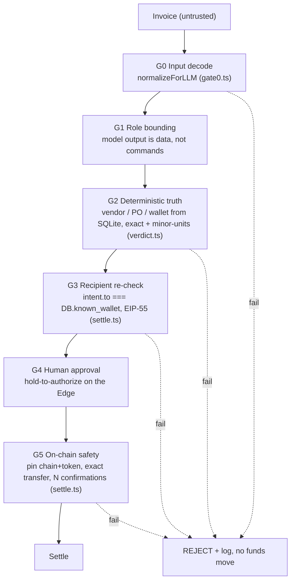
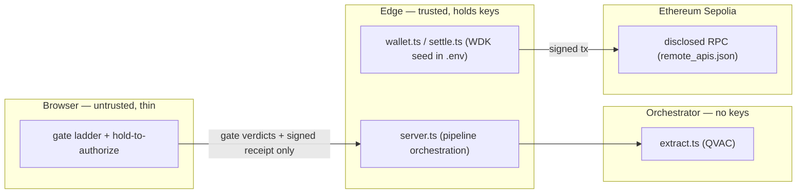

# Security model

A payment is impossible unless it clears every gate. The LLM extracts and proposes; it
never authorizes — the verdict and the send are plain deterministic code. Full attack
surface: [THREAT-MODEL.md](./THREAT-MODEL.md) (100 vectors). Encoding battery results:
[ADVERSARIAL-TESTING.md](./ADVERSARIAL-TESTING.md) (17/17).

## The six gates



| Gate | Code | Property | Threat refs |
|---|---|---|---|
| **G0** | [gate0.ts](./security/gate0.ts) `normalizeForLLM` | NFKC; strip zero-width/bidi/PUA/tag; decode Morse/base64/32/hex/ROT13/Caesar/Atbash/leet/homoglyph (nested, depth 3). A decoded imperative → flag + REJECT + log. | 1–22 |
| **G1** | [extract.ts](./packages/orchestrator/src/extract.ts) | The model returns a Zod-validated `{vendorName, invoiceAmount, …}` object via `responseFormat: json_schema`. It has no tool that moves money. | 1, 20 |
| **G2** | [verdict.ts](./packages/orchestrator/src/verdict.ts), [erp.ts](./packages/orchestrator/src/erp.ts) | `computeVerdict` reads vendor/PO/wallet from SQLite. Exact canonical-name match; integer minor-units; currency exact. `sqlite-vec` RAG can only *suggest*, never authorize — and it is **inert in the shipped server** (the app seeds without embeddings, so the KNN branch never executes); it is exercised in `npm run c3:demo`. | 36–54 |
| **G3** | [settle.ts](./packages/edge/src/settle.ts) | Before signing, `addressEquals(intent.to, DB.known_wallet)` is re-checked from a fresh DB read. A forged `intent.to` is blocked. | 45, 48, 61 |
| **G4** | [server.ts](./packages/edge/src/server.ts), [ui/](./packages/edge/ui/) | The send requires an explicit hold-to-authorize. The console binds **`127.0.0.1` only** — `/api/approve` signs a real transfer, so it is never exposed to the local network — and only one settlement may be in flight at a time. No `.env` wallet → stops here (demo mode). | 87, 88 |
| **G5** | [settle.ts](./packages/edge/src/settle.ts) | Pinned `chainId` (11155111) + token (`0xd077a4…e4fdb`); pre-flight balance; exact-amount `transfer` (no unbounded approve); waits 2 confirmations. | 55, 58–60, 64, 65, 72 |

## LLM proposes, code authorizes

The verdict is computed in [verdict.ts](./packages/orchestrator/src/verdict.ts) from DB
facts, not from model output:

```
decision = gate0Clean && vendorExists && vendorActive && amountParsed
           && poMatched && walletMatch && notDuplicate ? "PASS" : "REJECT"
```

The QVAC tool-calling demo ([tools.ts](./packages/orchestrator/src/tools.ts)) lets the
model *call* `lookup_vendor` / `match_purchase_order` / `verify_wallet`, but the handlers
are deterministic SQL and the verdict is recomputed in code — argument or confidence
spoofing cannot change it (threats #18, #53). Proven across PASS + three REJECT cases in
[evidence/c3-report.md](./evidence/c3-report.md).

## Trust boundaries



- **Browser** sees only gate verdicts and the final receipt — never the seed.
- **Edge** holds the WDK seed in gitignored `.env`; it is the only place that can sign.
  `@tetherto/wdk-secret-manager` (encrypted store) is the production path; the demo keeps
  the seed in `.env`.
- **Orchestrator** runs inference and has no key API surface (threat #92).
- **Remote calls** are non-AI only — Sepolia RPC, disclosed in
  [remote_apis.json](./remote_apis.json) with the assertion that inference is 100% local
  QVAC (threat #100).

## Honest limits

- Testnet only; never mainnet (`chainId` pinned to Sepolia).
- The demo broadcasts via the public mempool for reliable testnet inclusion; the
  MEV-protected RPC (Flashbots Protect) is pinned for production in
  [remote_apis.json](./remote_apis.json). A plain ERC-20 transfer has no extractable MEV
  (threat #55).
- Document-wallet corroboration tolerates ≤2-char OCR drift after confusable folding
  ([address.ts](./packages/shared/src/address.ts)). Forging a key within 2 chars of a
  fixed address is infeasible; payout still uses the strict DB address at sign time.
